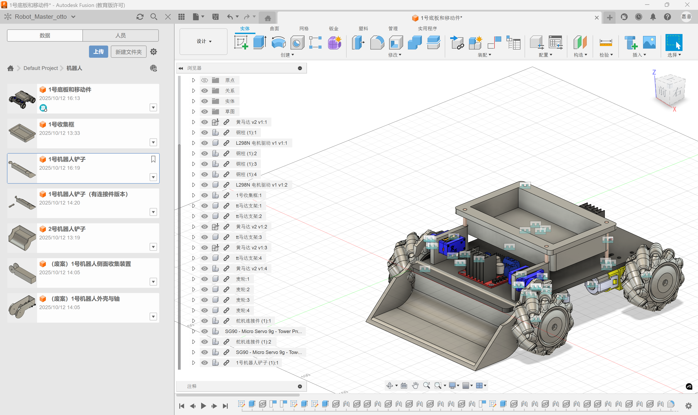
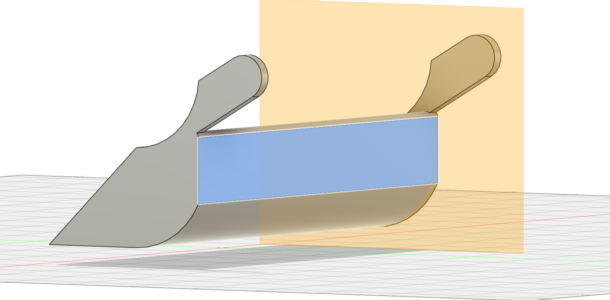

# ME_章嘉睿_一号机器人收集装置  
  
## 明晰机器人规格
“机器人的初始长宽尺寸不得超过270mm*180mm，高度不得超过240mm，伸展后最高高度不得超过600mm，重量不得超过2.5kg。”  
  
## 方案1: 扫地机器人方案  
大致是通过类似扫帚毛刷进行旋转的方式将小球通过斜面运送进入盒子中  
参考视频：BV1cN4y1F7Ur 【我的毕业设计：基于机器视觉的智能捡球小车-哔哩哔哩】 https://b23.tv/KCaNLRM  
视屏中的收集装置为侧置，我们实际上也考虑了中置的方案，但是最后发现它无论如何都会超大小。

## 方案2: 网球收集器方案  
仿照网球收集器将小球收集在小框中  
问题是这与我们一开始期望的抢高台的战略不符，因此我们将它排除  
  
## 方案3：铲子方案
铲子+收集框
用装在车子前部的舵机驱动铲子
收集框连接在架高铜柱上

为了方便测试可行性，我们完成了对1号机器人的整车建模，图片如下

自此，一号机器人铲子方案可行，下面进入拆分零件进行3D打印阶段

如图所示的拆分能更好的进行3D打印无需支撑，最后仅需将螺母烫入零件中即可
对收集框采取同样的操作，自此一号机器人设计完毕。