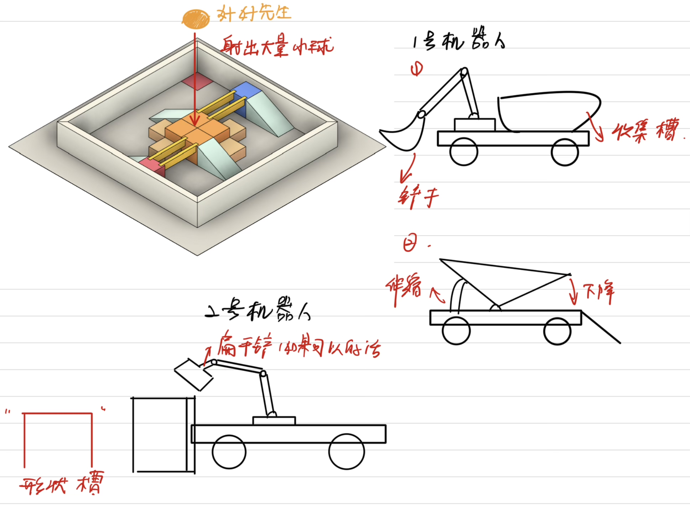
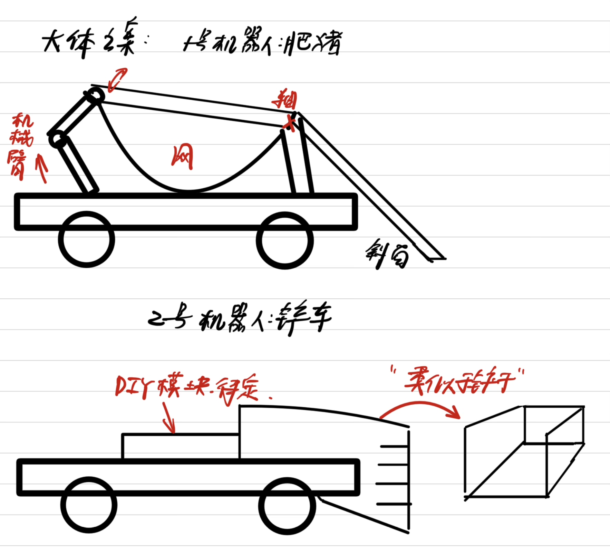

# ME_章嘉睿_参赛规则理解  

机器人分一号机器人和二号机器人  
比赛结束时优先比较1号机器人携带的弹丸数量，因此我们自然地想到2号机器人应当充当辅助我方1号和干扰对方1号机器人的作用  
理想情况对2号机器人的设想是高机动性的“扫地机”，即可以迅速地将弹丸聚集在一起，1号机器人则应当充当铲车的作用，将聚集在一起的弹丸铲入收集框  
  
问题1:如何守护收获的弹丸不被敌方的机器人拿走？  
问题2:如何灵活地对2号机器人进行设计，例如可否设计其能对1号机器人收集的弹丸进行偷窃？  
  
在经过讨论后，机械组给出两个机器人的大致设计方案  
模块分化如下  
1. 机器底盘的组装  
2. 1号机器人机械臂模块  
3. 1号机器人收集模块+斜面  
4. 2号机器人铲车模块  
5. 2号机器人DIY模块（如果有的话）  

