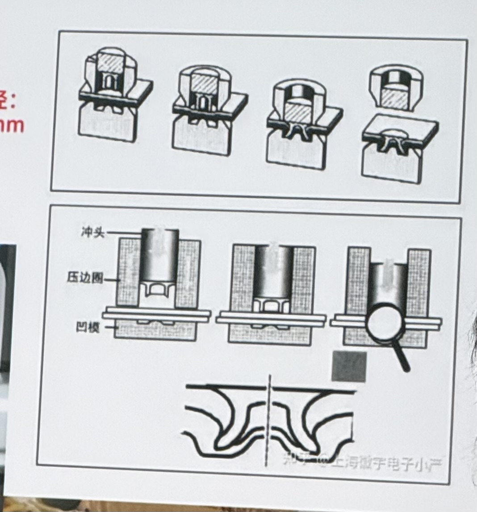
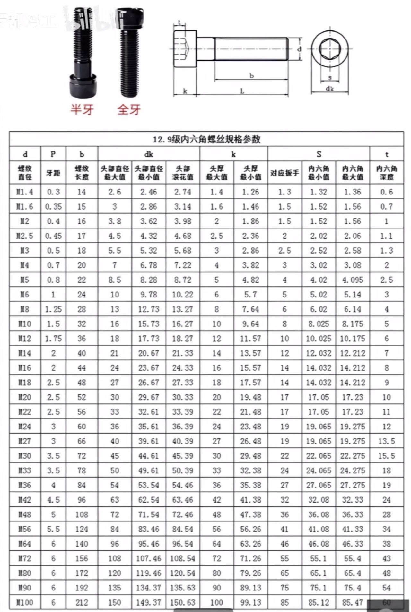
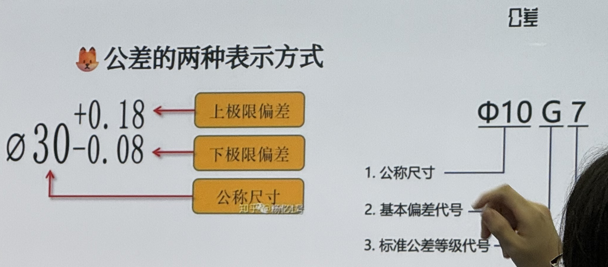
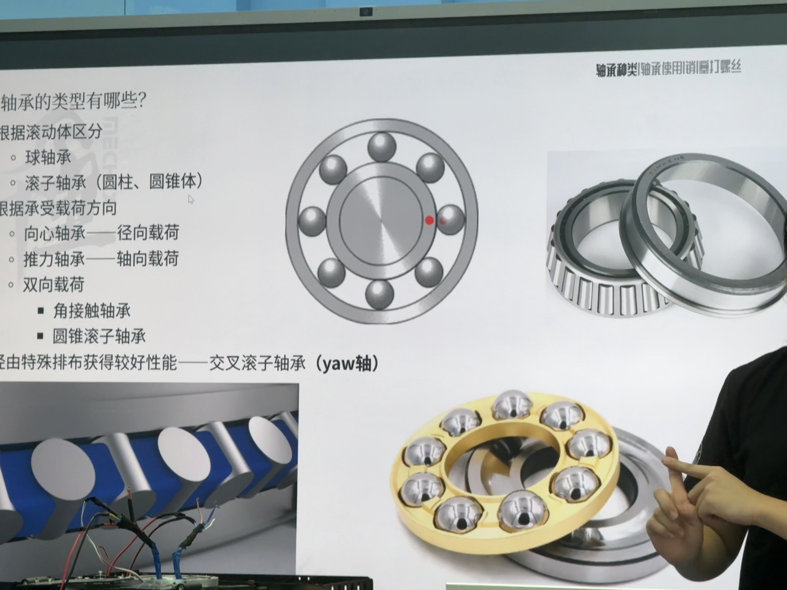

# ME_章嘉睿_标准件和材料的选取  
## 机架结构  
金属部件使用铝合金，可以通过在合金件中制造中空来减轻重量  
在无需连接但是对结构强度高的地方使用碳板  
碳板无法切割，可以尝试使用不同厚度的碳板进行分层  
  
## 螺丝螺母和铆钉  
### 螺丝  
RM的螺丝只采用不同型号的六角螺丝，为了防止因为使用十字螺丝滑丝  
硬度等级区分：3.5～12.9 等级越高硬度越大，有选择的情况下不要使用不锈钢螺丝  
螺丝购买：柏瑞特，固万基，塞打螺丝选择长安模具  
不同种类螺丝见图  

注意赛打螺丝是半牙的，一半有轮齿一半是圆柱  
  
### 螺母  
滚花螺母和防松螺母，以及永不松动的螺母  
### 铆钉  
利用冲头创造螺纹，具体过程见图  
螺纹创造在凹模上，然后使用铆钉固定  

### 标准尺寸  
注意沉头螺丝的长度需要从螺丝头开始算，机械组需要时刻记住M2.5～M5的螺丝头大小  
下图是标准六角螺丝件的尺寸标准  

零件标准值及其公差的记录  

  
## 轴承与轴系  
轴承是一种内外环之间通过钢珠连接减少摩擦的器件  
常使用法兰挡板轴承  
  
 
## 附录  
阅读公差代号  
### a) 标准公差等级 (IT等级)  
· 它决定了公差的大小（即范围的宽窄）。  
· 用数字表示，如 IT01, IT0, IT1, IT2, ..., IT18。  
· 数字越小，公差范围越小，精度要求越高，加工越困难，成本也越高。  
· 数字越大，公差范围越大，精度要求越低，加工越容易，成本也越低。  
  
常用等级说明：  
· IT5 - IT7：用于精密配合，如轴承与轴的配合。6、7级在机械制造中应用极广。  
· IT8 - IT10：用于一般要求的重要配合。  
· IT11 - IT12：用于不重要的配合或间隙较大的地方。  
· IT12以下：主要用于非配合尺寸（自由尺寸），如锻件、铸件等。  
  
所以，φ20 H7 和 φ20 H11 相比，虽然基本偏差都是H，但H7的公差范围要比H11小得多，精度要求更高。  
  
### b) 基本偏差代号  
· 它决定了公差带相对于基本尺寸的位置（即在基本尺寸的上面、下面，还是对称分布）。  
· 用字母表示，大写字母用于孔（如 H, G, K, P），小写字母用于轴（如 h, g, k, p）。  
基本偏差系列图是这个概念最直观的体现（虽然不需要精确记住，但要理解其含义）：  
  
· 对于孔 (A...ZC):  
  · A-G：公差带完全在基本尺寸的上方，即孔的实际尺寸一定大于基本尺寸。  
  · H：公差带在基本尺寸的上方，且下偏差为0。这是最常用的基准孔。  
  · JS：公差带对称于基本尺寸分布（±IT/2）。  
  · K-ZC：公差带主要在基本尺寸的下方（K、M等可能有一部分在上方，但N以后基本都在下方）。  
· 对于轴 (a...zc):  
  · a-g：公差带完全在基本尺寸的下方，即轴的实际尺寸一定小于基本尺寸。  
  · h：公差带在基本尺寸的下方，且上偏差为0。这是最常用的基准轴。  
  · js：公差带对称于基本尺寸分布（±IT/2）。  
  · k-zc：公差带主要在基本尺寸的上方（k、m等可能有一部分在下方，但n以后基本都在上方）。  
  
###  一个生动的例子：轴与孔的配合  
假设我们有一个孔 φ20 H7 和一根轴 φ20 f6。  
· 孔 `φ20 H7`:  
  · H 表示基准孔，下偏差为0。意味着孔的最小尺寸就是20.000毫米。  
  · 7 是IT7级，查表可知其公差为0.021毫米。  
  · 所以，孔的合格尺寸范围是：φ20.000 ~ φ20.021 mm。  
  · 它的公差带图是紧贴在20mm线上方的一个区域。  
· 轴 `φ20 f6`:  
  · f 表示一种间隙配合的基本偏差，它的公差带在基本尺寸的下方。  
  · 6 是IT6级，查表可知其公差为0.013毫米。  
  · 查表可得f的基本偏差（上偏差）为-0.020毫米。  
  · 所以，轴的合格尺寸范围是：φ19.967 ~ φ19.980 mm。  
  · 它的公差带图是位于20mm线下方的一个区域。  
· 配合结果：  
  · 最松的情况：最大孔（20.021） - 最小轴（19.967） = 最大间隙 0.054 mm。  
  · 最紧的情况：最小孔（20.000） - 最大轴（19.980） = 最小间隙 0.020 mm。  
  · 这意味着，无论怎么加工，只要零件合格，轴和孔之间永远存在间隙，轴可以轻松地在孔中转动。这就是 “间隙配合”。  
